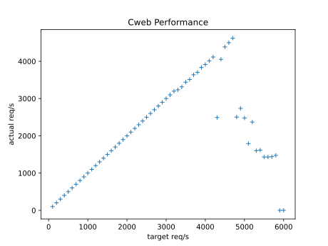

# cweb

The idea for cweb :

* Mostly have fun
* Very fast & light, but no threads or forks
* Only implement what's needed from the HTTP standard

* Honestly still not sure what I want to do with this, maybe an actual website ?
* Ways to build html with styles on runtime AND / OR comptime
* Potentially rewrite things in different languages ?

# Performance

This is in progress mostly not looking into numbers

